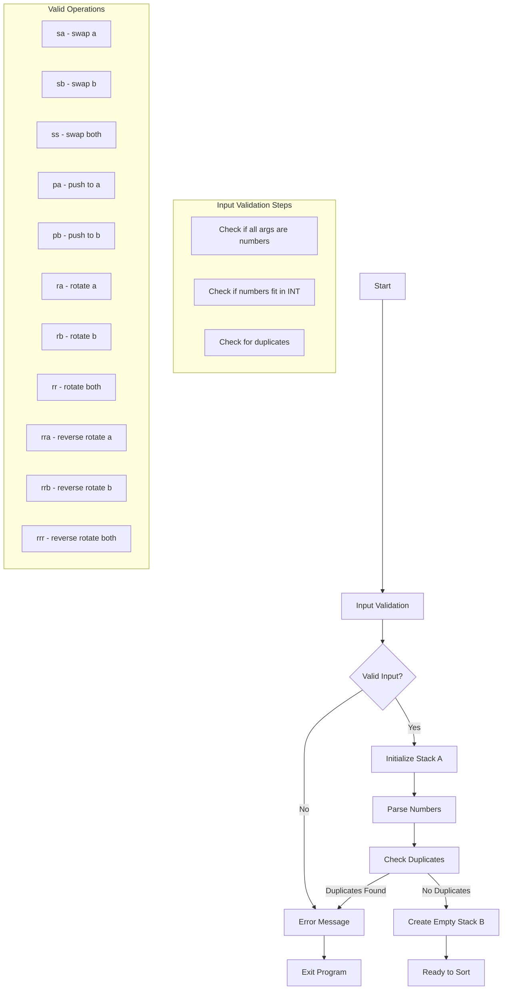

```mermaid
graph TD
    A[Start] --> B[Input Validation]
    B --> C{Valid Input?}
    C -->|No| D[Error Message]
    D --> E[Exit Program]
    C -->|Yes| F[Initialize Stack A]
    F --> G[Parse Numbers]
    G --> H[Check Duplicates]
    H -->|Duplicates Found| D
    H -->|No Duplicates| I[Create Empty Stack B]
    I --> J[Ready to Sort]

    subgraph Input Validation Steps
    K[Check if all args are numbers]
    L[Check if numbers fit in INT]
    M[Check for duplicates]
    end

    subgraph Valid Operations
    N[sa - swap a]
    O[sb - swap b]
    P[ss - swap both]
    Q[pa - push to a]
    R[pb - push to b]
    S[ra - rotate a]
    T[rb - rotate b]
    U[rr - rotate both]
    V[rra - reverse rotate a]
    W[rrb - reverse rotate b]
    X[rrr - reverse rotate both]
    end
```